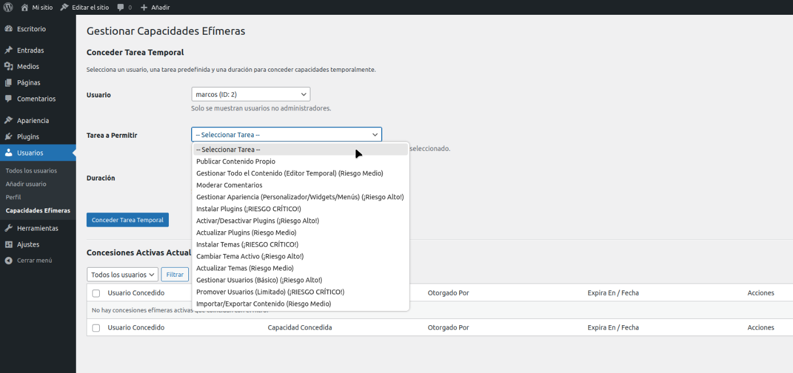
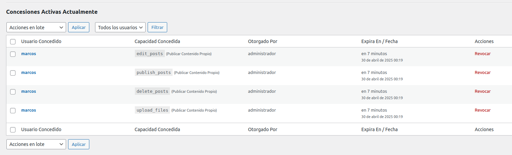

# Ephemeral Capabilities Manager

[](https://www.gnu.org/licenses/gpl-2.0.html)
[](https://github.com/soyunomas/ephemeral-capabilities-manager/releases/tag/v1.0.0)
[](https://wordpress.org/download/)
[](https://wordpress.org/download/)
[](https://www.php.net/releases/)

## Descripción

**Ephemeral Capabilities Manager (ECM)** mejora la seguridad de tu sitio WordPress permitiendo a los administradores conceder capacidades específicas o conjuntos predefinidos de capacidades (llamados "Tareas") a usuarios no administradores durante una **duración estrictamente limitada**.

¡Deja de dar acceso temporal de administrador o de elevar roles permanentemente para tareas de corta duración! ECM proporciona una forma segura y auditable de implementar el **Principio de Privilegio Mínimo** de forma dinámica.

### ¿Por qué ECM?

*   **Evita Riesgos:** Conceder temporalmente el rol de Administrador es peligroso.
*   **Evita Privilegios Permanentes:** Elevar el rol de un usuario de forma permanente para una tarea puntual deja una puerta abierta innecesaria.
*   **Solución Dinámica:** ECM aplica el privilegio mínimo *justo a tiempo* y lo revoca automáticamente.

### Características Principales

*   **Permisos Temporales:** Concede capacidades solo por el tiempo necesario (15 min, 1 hora, 4h, 8h, 1 día, 1 semana).
*   **Paquetes de Tareas:** Tareas comunes predefinidas (conjuntos de capacidades) para facilitar el uso (ej. Gestionar Contenido, Actualizar Plugins, Gestionar Apariencia).
*   **Indicadores de Riesgo:** Las tareas se marcan visualmente con niveles de riesgo (Bajo, Medio, Alto, Crítico).
*   **Aplicación del Privilegio Mínimo:** Solo concede capacidades que el usuario no posee ya para la tarea seleccionada.
*   **Implementación Segura:** Usa Nonces de WordPress, comprobaciones de capacidad (`promote_users`), sanitización de entradas, escapado de salidas y consultas seguras a la base de datos.
*   **Interfaz de Administración:** Interfaz clara bajo el menú "Usuarios" -> "Capacidades Efímeras" para conceder permisos y ver concesiones activas.
*   **Revocación:** Los administradores pueden revocar manualmente concesiones activas antes de que expiren (individualmente o en lote).
*   **Filtrado:** Filtra fácilmente las concesiones activas por usuario.
*   **Limpieza Automática:** Tarea WP-Cron (por defecto: cada hora) mantiene ordenada la tabla de concesiones marcando las expiradas.
*   **Internacionalización:** Listo para traducir.

---

## Instalación

### Opción 1: Subir ZIP desde WordPress

1.  Descarga la última versión como archivo `.zip` desde la sección [Releases](https://github.com/soyunomas/ephemeral-capabilities-manager/releases) de este repositorio.
2.  En tu panel de WordPress, ve a `Plugins` -> `Añadir nuevo`.
3.  Haz clic en `Subir plugin`.
4.  Selecciona el archivo `.zip` descargado y haz clic en `Instalar ahora`.
5.  Activa el plugin.

### Opción 2: Manualmente (vía FTP/SFTP/SSH)

1.  Descarga y descomprime la última versión desde [Releases](https://github.com/soyunomas/ephemeral-capabilities-manager/releases) o clona el repositorio:
    ```bash
    git clone https://github.com/soyunomas/ephemeral-capabilities-manager.git
    ```
2.  Sube la carpeta `ephemeral-capabilities-manager` completa al directorio `/wp-content/plugins/` de tu instalación de WordPress.
3.  Ve a tu panel de WordPress -> `Plugins` y activa "Ephemeral Capabilities Manager".

---

## Uso

1.  Como **Administrador** (o un usuario con la capacidad `promote_users`), navega a `Usuarios` -> `Capacidades Efímeras`.
2.  En el formulario **"Conceder Tarea Temporal"**:
    *   **Selecciona el Usuario:** Elige un usuario no administrador del desplegable.
    *   **Selecciona la Tarea a Permitir:** Elige una tarea. Las opciones se filtran automáticamente para mostrar solo tareas que otorgan capacidades que el usuario no posee. Fíjate en los indicadores de riesgo (Medio, Alto, Crítico). La descripción de la tarea aparecerá debajo.
    *   **Selecciona la Duración:** Elige por cuánto tiempo estará activo el permiso (ej: 15 Minutos, 1 Hora, etc.).
    *   Haz clic en **"Conceder Tarea Temporal"**.
3.  La tabla **"Concesiones Activas Actualmente"** mostrará todas las concesiones que aún no han expirado.
    *   Puedes **filtrar** la tabla por usuario.
    *   Puedes **revocar** una concesión individual haciendo clic en el enlace "Revocar".
    *   Puedes seleccionar varias concesiones y usar la acción en lote **"Revocar Seleccionadas"**.

---

## Preguntas Frecuentes (FAQ)

### ¿Qué pasa cuando expira el tiempo?

El usuario pierde inmediatamente las capacidades concedidas. La comprobación central de permisos (filtro `user_has_cap`) compara constantemente el tiempo de expiración de la concesión con la hora actual. Incluso si la tarea Cron de limpieza en segundo plano aún no se ha ejecutado, el permiso desaparece efectivamente en el momento en que pasa el tiempo de expiración.

### ¿Puedo conceder permisos a Administradores?

No. El plugin está diseñado para conceder *elevaciones temporales* a usuarios con *menos* privilegios. Los administradores ya tienen todas las capacidades, por lo que concederles capacidades temporales es innecesario y potencialmente confuso. El desplegable de selección de usuario excluye a los administradores.

### ¿Qué 'Tareas' están disponibles por defecto?

El plugin incluye paquetes para tareas comunes como:

*   Publicar Contenido Propio (Riesgo Bajo)
*   Gestionar Todo el Contenido (Riesgo Medio)
*   Moderar Comentarios (Riesgo Bajo)
*   Gestionar Apariencia (Riesgo Alto)
*   Instalar Plugins (Riesgo Crítico)
*   Activar/Desactivar Plugins (Riesgo Alto)
*   Actualizar Plugins (Riesgo Medio)
*   Instalar Temas (Riesgo Crítico)
*   Cambiar Tema Activo (Riesgo Alto)
*   Actualizar Temas (Riesgo Medio)
*   Gestionar Usuarios (Básico) (Riesgo Alto)
*   Promover Usuarios (Limitado) (Riesgo Crítico)
*   Importar/Exportar Contenido (Riesgo Medio)

### ¿Qué pasa si concedo una tarea pero el usuario ya tiene esas capacidades?

El plugin lo comprueba antes de concederla. Si la tarea seleccionada no proporciona ninguna capacidad **nueva** que el usuario no posea ya (directamente o a través de su rol), la concesión será denegada y se mostrará un mensaje de error.

### ¿Puede un usuario ver qué permisos temporales tiene?

Actualmente (v1.0.0), no hay una interfaz específica para que el *usuario final* vea sus concesiones efímeras activas. Solo los administradores (con la capacidad `promote_users`) pueden ver la lista en la página de administración del plugin. Esto podría ser una característica para una versión futura.

### ¿Qué pasa si desactivo el plugin?

Al desactivarlo, se elimina la tarea WP-Cron programada para la limpieza. La tabla de base de datos personalizada (`wp_ephemeral_grants`) y las opciones del plugin permanecen en la base de datos, pero el filtro central (`user_has_cap`) ya no está activo, por lo que **todos los permisos temporales concedidos por este plugin dejan de funcionar inmediatamente**, incluso si su tiempo de expiración no ha llegado según la base de datos.

### ¿Qué pasa si elimino el plugin?

Al eliminarlo a través de la pantalla de Plugins de WordPress, se ejecuta el script `uninstall.php` y **elimina completamente** la tabla de base de datos personalizada (`wp_ephemeral_grants`), la opción de versión del plugin de `wp_options`, y asegura que la tarea WP-Cron esté desprogramada. Es una eliminación limpia.

### ¿Es compatible con plugins de Autenticación de Dos Factores (2FA)?

Sí, debería ser totalmente compatible. ECM opera sobre las capacidades de WordPress *después* de que un usuario haya iniciado sesión correctamente. Los plugins de 2FA suelen actuar *durante* el propio proceso de inicio de sesión. Funcionan en capas diferentes.

---

## Capturas de Pantalla (Placeholders)

1.  **Desplegable de Tareas con Indicadores de Riesgo:**
    
    
2.  **Tabla de Concesiones Activas:**
    

---

## Licencia

Este plugin está licenciado bajo la **GPLv2 o posterior**.
Consulta la [Licencia GPLv2](https://www.gnu.org/licenses/gpl-2.0.html) para más detalles.

---

## Registro de Cambios

### 1.0.0 (29 de Abril de 2025)

*   Lanzamiento público inicial.
*   Funcionalidad para conceder Paquetes de Tareas (conjuntos de capacidades) a usuarios no administradores por una duración limitada.
*   Interfaz de administración para gestionar concesiones (conceder, ver, filtrar, revocar individual/lote).
*   Comprobación de expiración en tiempo real y limpieza automática vía WP-Cron.
*   Filtrado dinámico de tareas, indicadores de riesgo y validaciones.
*   Implementación segura y `uninstall.php` para eliminación limpia.
